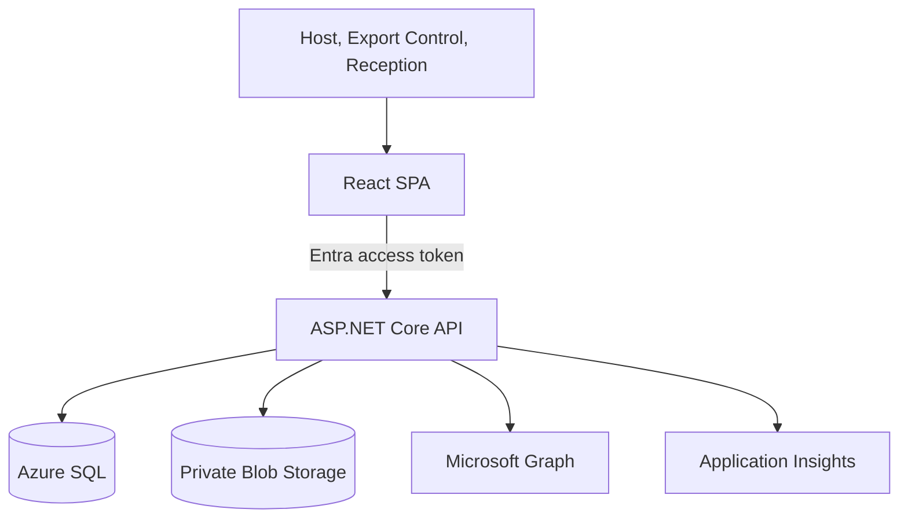
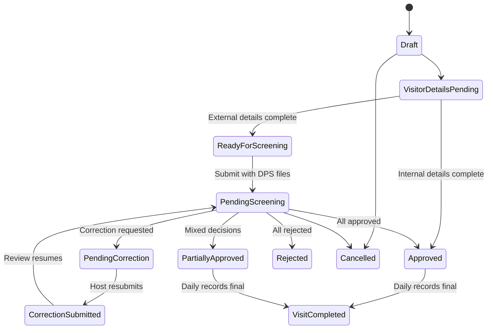

# Architecture

## System context

The browser never connects to SQL, Blob Storage, or Microsoft Graph. DPS content passes only through an Export Control-authorized API endpoint. Hosts can create or replace DPS content through the upload endpoint but cannot retrieve it. Reception receives no DPS metadata or file endpoint access.

## Backend boundaries

| Layer | Responsibility | May depend on |
|---|---|---|
| Domain | Invariants, state transitions, entities and value objects | .NET base libraries |
| Application | Authorization-aware use cases, validation, DTO mapping | Domain |
| Infrastructure | EF Core, Azure SQL, Blob, Graph, background workers | Application, Domain |
| API | HTTP, authentication, authorization, errors and rate limits | Application, Infrastructure |

The aggregate root is `VisitorRequest`. Mutations load the complete aggregate, verify the actor and role, set the expected SQL row version, perform one domain transition, append before/after audit data, and save atomically. A stale row version returns HTTP 409.

## Data ownership

- `VisitorRequest` owns visitors, visit days, screening reviews, correction requests, schedule changes, and audit events.
- `Visitor` owns versioned details, declared assets, versioned DPS metadata, and one Reception record per visit day.
- DPS bytes are stored outside SQL. SQL stores the immutable blob name, hash, size, version, uploader, and timestamps.
- Notification work is committed to an outbox in the same database transaction as the workflow change.
- Download events are separately recorded with actor, document, request, visitor, correlation ID, and timestamp.

## State behavior

Rescheduling is a cross-cutting transition available until the first check-in. For external requests it returns the aggregate to `ReadyForScreening` and resets all decisions and Reception records.

## Time and concurrency

- Times are persisted as `datetimeoffset`.
- A configured IANA or Windows timezone determines the local business date and scheduled-arrival comparison.
- Reception verification and check-in are accepted only on the selected scheduled day.
- SQL `rowversion` provides optimistic concurrency for every user mutation.
- An indexed filtered constraint prevents two active check-ins from using the same badge.
- Request number allocation uses a serializable transaction and SQL update/range locks.
